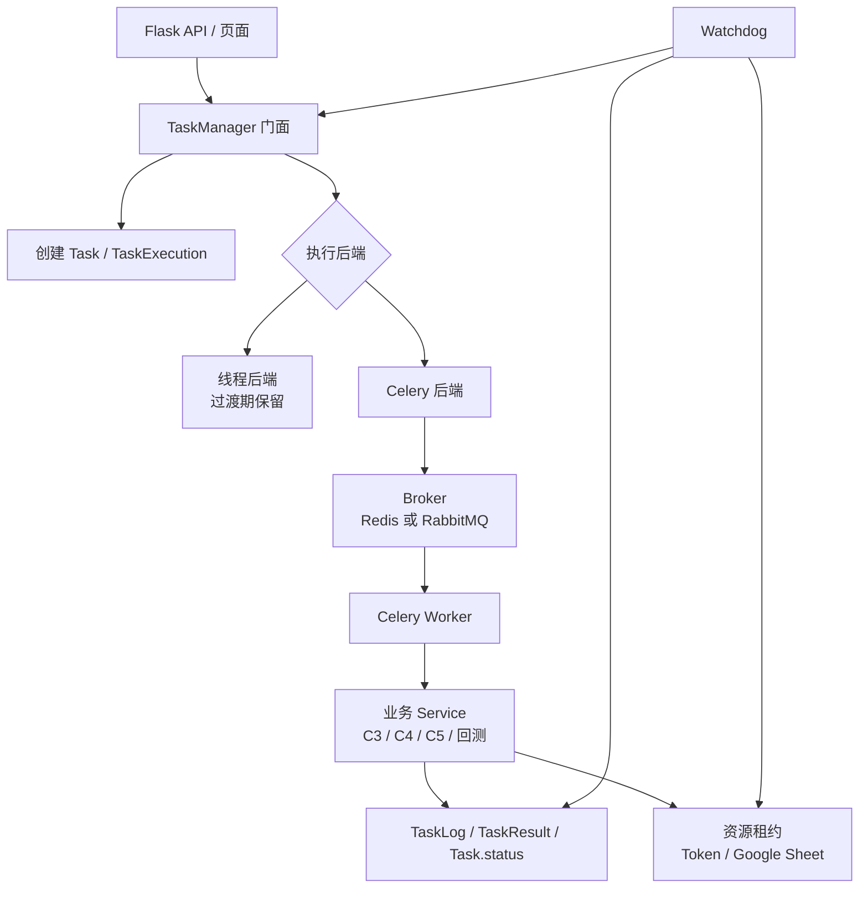

# Celery 长任务迁移适配性评估

生成日期：2026-05-27  
适用范围：当前 Flask 任务执行平台的业务长任务、C31 批量拆分任务、回测任务、定时维护任务和看门狗恢复链路。

## 1. 结论

当前项目适合迁移到 Celery 作为长任务执行层，但不适合直接“一步替换线程模型”。

更准确的判断是：

- 作为中长期架构目标：适合。
- 作为立刻落地的一次性改造：风险较高。
- 推荐路径：先把任务状态、取消信号、资源占用和恢复判断从进程内内存状态中剥离出来，再把执行入口切到 Celery。

当前系统的核心问题不是“有没有任务队列”，而是业务任务的运行态同时依赖：

- 数据库中的 `Task.status`
- `TaskManager.running_tasks`
- `TaskManager.task_stop_events`
- `TaskManager.task_token_occupancy`
- Google Sheet 占用表
- Google Sheet token 当前占用计数
- 看门狗对日志和错误标记的扫描
- 启动期清理和重置逻辑

Celery 能很好地解决“Web 进程内起线程执行长任务”的稳定性问题，但它不会自动解决状态一致性、任务取消、资源租约、断点恢复和幂等问题。迁移是否成功，取决于这些语义是否先被显式建模。

建议采用“分阶段迁移，双执行后端过渡”的方案：

1. 保留现有 `TaskManager` 对外接口，先抽象执行后端。
2. 增加持久化执行状态字段或新表，把内存态转成 DB 可恢复状态。
3. 改造服务层取消逻辑，使其从 `threading.Event` 迁移为可持久化的取消信号。
4. 把资源占用改造成原子租约。
5. 最后接入 Celery worker，并逐步把 C3、C4、C5、回测、多品回测切过去。

## 2. 分析依据

本评估主要参考当前仓库中的这些文件和链路：

- `run.py`
- `app/__init__.py`
- `app/startup.py`
- `app/models.py`
- `app/routes/task_api.py`
- `app/services/task/facade.py`
- `app/services/task/creation.py`
- `app/services/task/runtime.py`
- `app/services/task/restart.py`
- `app/services/task/occupancy.py`
- `app/services/task/query.py`
- `app/services/task_watchdog.py`
- `app/services/scheduler_service.py`
- `app/services/scheduled_task_worker.py`
- `app/services/google_sheet_token_service.py`
- `app/services/google_sheet_registry_service.py`
- `app/utils/task_error_utils.py`
- `requirements.txt`
- `docs/项目规划/平台演进蓝图-2026-05-15/01-基于当前平台上下文的架构演进方案.md`
- `docs/后端/后端整体框架设计评审-2026-04-29.md`
- `docs/后端/后端架构优化详细指南.md`

当前 `requirements.txt` 中尚未引入 Celery、Redis Python 客户端或 RabbitMQ 相关依赖，说明项目还没有真正进入 Celery 执行态。

## 3. 当前长任务执行模型

### 3.1 启动链路

真实启动链路是：

```text
run.py
  -> create_app()
  -> bootstrap_app(app)
      -> db.create_all()
      -> ensure_*_schema()
      -> reset_google_sheet_token_occupancy()
      -> reset_google_sheet_occupancy()
      -> init_config()
      -> init_rbac()
      -> check_and_cleanup_dead_tasks()
      -> init_scheduler()
      -> init_task_watchdog()
```

这个启动链路说明当前系统强依赖启动期补偿：

- 重置 Google Sheet token 占用。
- 重置 Google Sheet 表资源占用。
- 清理数据库显示为 `running` 但本地线程不存在的任务。
- 启动 APScheduler。
- 启动看门狗线程。

这类补偿逻辑对单进程或少量进程可用，但当任务执行迁到 Celery worker 后，Web 进程启动期不能再粗暴判断“本地没有线程就是死任务”。因为任务可能正在其他 worker 中正常执行。

### 3.2 业务任务主入口

当前业务任务门面是：

```text
app/services/task/facade.py
  TaskManager
    running_tasks: task_id -> threading.Thread
    task_stop_events: task_id -> threading.Event
    start_errors
    task_token_occupancy
```

对外接口仍然集中在 `TaskManager`：

- `create_task()`
- `create_and_start_task()`
- `batch_create_and_start_task()`
- `start_task()`
- `cancel_task()`
- `restart_task()`
- `check_local_task_status()`
- `release_task_token_occupancy()`
- `release_google_sheet_occupancy()`

这对迁移是好消息。因为外部 API 层大多不需要直接知道任务怎么执行，只要 `TaskManager` 背后的执行后端可以被替换。

### 3.3 当前执行方式

`TaskRuntimeMixin.start_task()` 当前做了很多事情：

1. 检查 DB 中任务是否为 `pending`。
2. 对回测任务检查同一 Google Sheet 是否已经有任务运行。
3. 检查 `max_concurrent_tasks`，依据是 `len(self.running_tasks)`。
4. 建立 Google Sheet 占用。
5. 校验并增加 token 使用计数。
6. 创建 `threading.Event`。
7. 按任务类型创建 `threading.Thread`。
8. 线程内调用对应 service 的 `execute_task()`。
9. finally 中释放 token、释放 sheet、清理 `running_tasks` 和 `task_stop_events`。

对应的任务类型包括：

- `google_sheet`
- `google_sheet_C4`
- `google_sheet_C5`
- `backtest_training`
- `backtest_multi_product`

这说明当前 `start_task()` 不只是“启动执行器”，它同时承担了调度、状态转换、资源租约、并发控制、取消句柄创建和执行线程创建。迁移 Celery 前，最重要的工作就是拆开这些职责。

### 3.4 C31 批量任务

C31 当前不是独立执行器，而是在：

```text
TaskCreationMixin.batch_create_and_start_task()
```

中拆成多个 `google_sheet` 子任务。每个子任务会被立即 `create_task()` 并尝试 `start_task()`。

这对 Celery 是天然适配点：

- C31 本身可以继续作为批量拆分入口。
- 拆出来的每个 C3 子任务可以投递到 Celery queue。
- 启动失败不再一定代表“无法执行”，而可能代表“已入队等待资源”。

但需要调整返回语义。当前返回里有 `started_task_ids` 和 `failed_to_start`，Celery 化后更合理的是：

- `created_task_ids`
- `queued_task_ids`
- `rejected_task_ids`
- `resource_waiting_task_ids`

### 3.5 定时任务模型

定时任务系统已经比业务任务更接近“worker 化”：

```text
APScheduler
  -> SchedulerService._execute_task()
  -> ScheduledTask.is_running / running_instance_id 抢锁
  -> subprocess.Popen(app/services/scheduled_task_worker.py)
  -> worker 子进程执行清理函数
  -> worker 释放锁
```

这说明项目已经存在两个重要经验：

- 主进程只负责触发和抢锁。
- 真正执行可以放到独立进程。

Celery 可以替代这里的 `subprocess.Popen()`，但不建议一开始就把业务长任务和定时维护任务同时大改。更稳妥的路径是：

1. 先让 APScheduler 保持不变。
2. 定时任务触发后只负责 enqueue Celery task。
3. 后续再评估是否迁移到 Celery Beat。

### 3.6 看门狗恢复模型

`task_watchdog.py` 当前定期扫描：

- 最近 5 天的 `running` 任务。
- 最近 5 天 `error_message` 带 `[NETWORK_RETRYABLE]` 前缀的 `error` 任务。

恢复方式是：

```text
task_manager.cancel_task(task_id)
task_manager.restart_task(task_id, resume_from_checkpoint=True)
```

这套逻辑在进程内线程模型下可用，但迁移 Celery 后要重写判断依据：

- 不能再通过本地线程判断任务是否存活。
- 应通过 worker heartbeat、Celery task id、DB 状态更新时间、日志时间、租约过期时间判断。
- 对网络可恢复错误，可以使用 Celery retry，也可以继续由业务看门狗重启，但二者不能同时无约束启用。

## 4. Celery 能带来的收益

### 4.1 Web 进程与长任务执行解耦

当前 Web 进程直接创建线程执行长任务。任务耗时、网络抖动、Google Sheet IO、回测计算都会和 Flask 进程共存。

Celery 化后：

- Web 进程只负责创建任务和投递消息。
- Worker 进程负责执行长任务。
- Flask 重启不应直接杀死已经被 worker 接管的任务。
- 可独立扩缩 worker。

这是当前项目最值得迁移的原因。

### 4.2 更自然的队列与限流

当前并发控制依赖：

```text
len(TaskManager.running_tasks) >= max_concurrent_tasks
```

这个判断只对当前 Python 进程有效。多进程 Gunicorn、多台机器或 Celery worker 后都会失效。

Celery 可以提供：

- 队列隔离。
- worker 并发数控制。
- worker autoscale。
- `worker_prefetch_multiplier=1` 降低长任务预取导致的排队不均。
- 按任务类型路由到不同队列。

建议队列初始划分：

```text
google_sheet_c3
google_sheet_c4
google_sheet_c5
backtest
maintenance
default
```

是否拆得这么细可以按实际吞吐调整，但至少应把回测任务和普通 Google Sheet 任务分队列。

### 4.3 更好的故障隔离

当前线程中的资源泄漏、库级别阻塞或未捕获异常都发生在 Flask 宿主进程内。

Celery worker 可以通过：

- `worker_max_tasks_per_child`
- task soft time limit
- task hard time limit
- 独立 worker 进程重启

减少单个任务对 Web 服务的影响。

### 4.4 更清晰的部署拓扑

迁移后可以形成更清晰的角色：

```text
Flask Web
  负责页面、API、权限、任务定义、结果查询

Celery Broker
  负责消息投递

Celery Worker
  负责 C3 / C4 / C5 / 回测执行

Database
  负责业务状态、日志、结果、资源租约、恢复依据

Watchdog
  负责 DB 视角的异常恢复，不再依赖本地线程表
```

## 5. Celery 不能自动解决的问题

### 5.1 取消任务

当前取消依赖：

```text
task_stop_events[task_id].set()
```

服务层通过 `threading.Event` 感知取消。Celery 的 `revoke()` 并不能可靠中断已经在执行中的普通 Python 代码，尤其是任务正在网络 IO 或业务循环里时。

迁移前必须改成可持久化的协作取消：

- 在 `Task` 或新执行表中增加 `cancel_requested`。
- 服务层循环中定期读取取消标记。
- `cancel_task()` 更新 DB 标记，同时可调用 Celery revoke 作为辅助。
- worker 收到取消标记后返回 `cancelled`，统一走收尾释放逻辑。

如果只把 `threading.Event` 替换成 Celery revoke，会导致取消语义不稳定。

### 5.2 资源占用释放

当前释放依赖 worker 线程 finally：

- `release_task_token_occupancy(task_id)`
- `release_google_sheet_occupancy(task_id)`
- 回测 sheet 文件锁释放

Celery worker 异常退出、机器重启、hard time limit 杀进程时，finally 不一定有机会完成。因此资源占用必须从“内存记录 + finally 释放”升级为“DB 租约 + 过期恢复”。

建议引入资源租约语义：

```text
resource_type
resource_id
task_id
worker_id
acquired_at
heartbeat_at
expires_at
released_at
status
```

如果不新建表，至少也要让 `GoogleSheet.current_task_id`、token 使用计数和任务执行状态具备可重建能力。

### 5.3 token 使用计数并发一致性

`GoogleSheetTokenService` 当前通过扫描 `Task.status == 'running'` 构建实时使用快照，再更新 token 的 `current_in_use_count`。

这个模型在 Celery 多 worker 下有两个风险：

- 多 worker 同时通过快照判断可用，可能超发。
- `current_in_use_count` 既像缓存又像状态源，容易与真实 running 任务不一致。

Celery 迁移前建议改为原子领取：

```sql
UPDATE google_sheet_tokens
SET current_in_use_count = current_in_use_count + 1
WHERE id = :token_id
  AND is_active = true
  AND (
    max_usage_count <= 0
    OR current_in_use_count < max_usage_count
  )
```

如果更新行数为 0，则说明领取失败。释放时再扣减，同时保留启动期或看门狗对脏计数的 reconcile。

### 5.4 Google Sheet 占用原子性

`GoogleSheetRegistryService.acquire_for_task()` 当前先读后写。多 worker 下建议改成原子 update：

```sql
UPDATE google_sheet
SET is_in_use = true,
    current_task_id = :task_id
WHERE id = :sheet_id
  AND is_active = true
  AND (
    is_in_use = false
    OR current_task_id = :task_id
  )
```

否则多个 worker 同时抢同一 sheet 时，可能出现并发竞争窗口。

### 5.5 状态机仍需业务层定义

Celery 有自己的状态，例如 `PENDING`、`STARTED`、`SUCCESS`、`FAILURE`、`RETRY`、`REVOKED`。但当前项目已经有业务状态：

- `pending`
- `running`
- `completed`
- `cancelled`
- `error`

建议不要直接把 Celery 状态暴露为业务状态。更稳的做法是：

- `Task.status` 继续作为用户可见业务状态。
- 新增执行状态字段或 `TaskExecution` 表记录 Celery 运行细节。
- Celery 状态只作为执行层状态，不直接替代业务状态。

### 5.6 看门狗需要重构

迁移后原来的 `check_local_task_status()` 语义会失效，因为“本地没有线程”不代表任务死了。

看门狗应改为检查：

- `Task.status == running`
- `TaskExecution.worker_id`
- `TaskExecution.celery_task_id`
- `TaskExecution.heartbeat_at`
- `TaskExecution.lease_expires_at`
- 最近日志时间
- 最近结果时间
- `error_message` 中的 `[NETWORK_RETRYABLE]`

如果继续用本地线程判断，会误杀正常 Celery 任务。

### 5.7 ConfigManager 的进程间一致性

当前配置管理有缓存。Celery worker 是独立进程，配置变更后如果 worker 长时间不重启，需要明确：

- 哪些配置每次读取都直读 DB。
- 哪些配置允许缓存。
- 缓存是否有 TTL。
- 管理后台更新配置后是否通知 worker。

对任务执行关键配置，例如并发、watchdog、token 上限、网络代理、dfcf 代理开关，建议使用短 TTL 或任务启动时固化到 task config。

## 6. 适配性评分

| 维度 | 当前状态 | Celery 适配性 | 判断 |
|---|---|---:|---|
| Web 与执行解耦 | 当前耦合在线程内 | 高 | Celery 很适合 |
| 任务状态持久化 | 业务状态已入 DB，但执行句柄在内存 | 中 | 需增加执行层状态 |
| 取消能力 | 依赖 `threading.Event` | 低到中 | 必须改协作取消 |
| 重试恢复 | 已有 `[NETWORK_RETRYABLE]` 和 watchdog | 中高 | 可迁移，但要防重复重试 |
| 资源占用 | 有 DB 字段，但领取不是完全原子租约 | 中 | 需原子化 |
| C31 批量拆分 | 已拆为多个 C3 子任务 | 高 | 很适合队列化 |
| 回测串行约束 | 已有 DB 查询和文件锁 | 中 | 需转为 worker 安全租约 |
| 定时任务 | 已有子进程 worker 雏形 | 高 | 可先 enqueue Celery |
| 部署复杂度 | 当前依赖 Flask + DB | 中低 | 需新增 broker 和 worker |
| 运维可观测性 | DB 日志较完整，worker 指标不足 | 中 | 需补 Celery 监控 |

综合判断：**中高适配，但必须先做执行状态和资源租约改造。**

## 7. 推荐目标架构

### 7.1 保留 TaskManager 门面

不建议让 Flask route 直接调用 Celery task。应保留：

```text
routes/task_api.py
  -> task_manager.create_and_start_task()
  -> task_manager.start_task()
  -> executor_backend.enqueue(task_id)
```

这样前端、权限、模板回填、C31 拆分和任务查询接口可以少改。

### 7.2 新增执行后端抽象

建议新增类似结构：

```text
app/services/task/executor.py
  TaskExecutorBackend
  ThreadTaskExecutorBackend
  CeleryTaskExecutorBackend
```

过渡期可以用配置切换：

```text
task_executor_backend = thread | celery
```

这样可以先让一类任务试点 Celery，例如先迁 C3，再迁 C4/C5，最后迁回测。

### 7.3 新增 TaskExecution 或执行字段

推荐新建表，而不是继续加重 `tasks` 表：

```text
task_executions
  id
  task_id
  backend
  celery_task_id
  queue_name
  worker_id
  status
  attempt
  cancel_requested
  heartbeat_at
  lease_expires_at
  started_at
  finished_at
  error_message
  created_at
  updated_at
```

如果短期不想新表，至少应在 `tasks` 上增加：

- `executor_backend`
- `executor_task_id`
- `worker_id`
- `heartbeat_at`
- `cancel_requested`
- `attempt_count`

但长期看，新表更干净，因为一个业务任务可能多次重启、多次尝试。

### 7.4 Celery task 只接收 task_id

不要把完整配置塞进 broker 消息。建议 Celery 任务只接收：

```python
execute_task(task_id: str)
```

worker 内部重新从 DB 读取 `Task.config`。原因：

- 配置可能较大。
- 配置中可能包含敏感 token 文件信息。
- DB 是当前系统恢复、重启、回填的事实来源。
- 避免消息和 DB 状态不一致。

### 7.5 服务层取消适配器

现有 service 构造接收 stop event：

```python
service_class(task.config, task_id, app, self.task_stop_events.get(task_id))
```

Celery 化后可以提供兼容适配器：

```python
class DbCancelToken:
    def __init__(self, task_id):
        self.task_id = task_id

    def is_set(self):
        return Task.query.filter_by(id=self.task_id, cancel_requested=True).first() is not None
```

为了减少 DB 压力，可以加短 TTL 缓存，或者只在每个参数组合完成后检查一次。

### 7.6 状态转换统一入口

建议把这些状态转换集中到一个模块：

```text
pending -> queued
queued -> running
running -> completed
running -> cancelled
running -> error
error -> pending
cancelled -> pending
```

当前 `Task.status` 没有 `queued`，可以先不加，但 Celery 引入后强烈建议增加或在 `TaskExecution.status` 中表达。否则大量 Celery 已入队但未执行的任务仍会显示为 `pending`，用户体验和 watchdog 判断都会变模糊。

## 8. 推荐迁移路线

### 阶段 0：迁移前准备

目标：不改变行为，先把风险点收拢。

建议改造：

- 梳理 `TaskRuntimeMixin.start_task()`，拆分出资源领取、状态转换、执行投递。
- 增加执行后端接口，但默认仍使用线程后端。
- 明确 `Task.status` 与执行后端状态的映射。
- 给 `running_tasks` 和 `task_stop_events` 增加更严格的访问边界，避免 route 或 watchdog 直接依赖内部 dict。
- 为取消、重启、失败收尾补测试。

验收标准：

- 线程执行模式行为不变。
- C3、C4、C5、回测、多品回测仍可正常创建、取消、重启。
- C31 仍可拆分并启动子任务。
- 看门狗仍能处理网络可恢复错误。

### 阶段 1：持久化执行状态和取消信号

目标：让任务执行不再依赖进程内句柄才能恢复。

建议改造：

- 增加 `TaskExecution` 表或等价字段。
- 增加 `cancel_requested`。
- 增加 `heartbeat_at`。
- 服务层用取消 token 适配器替代直接依赖 `threading.Event`。
- `check_local_task_status()` 改名或新增 DB 视角的 `check_task_execution_status()`。

验收标准：

- Web 进程重启后，不再简单把所有本地无线程的 running 任务视为可重启。
- 取消信号可以被 worker 进程识别。
- watchdog 可以基于 heartbeat 判断任务是否异常。

### 阶段 2：资源占用改造成原子租约

目标：支持多 worker 并发下的资源正确性。

建议改造：

- token 领取改成数据库原子 update。
- Google Sheet 领取改成数据库原子 update。
- 回测同 sheet 串行约束从“内存锁 + 文件锁 + running 查询”升级成 DB 租约。
- 保留启动期 reconcile，但不再作为主流程正确性的依赖。

验收标准：

- 多个 worker 同时抢同一 token 不超发。
- 多个 worker 同时抢同一 Google Sheet 不重复占用。
- worker 异常退出后，租约可被 watchdog 或启动修复逻辑恢复。

### 阶段 3：引入 Celery 基础设施

目标：让 Celery 能跑一个最小任务闭环。

建议新增：

```text
app/celery_app.py
app/tasks/__init__.py
app/tasks/execution.py
```

初始配置建议：

```text
broker: Redis 或 RabbitMQ
result_backend: 可选，优先以 DB 为业务结果源
task_serializer: json
accept_content: json
timezone: Asia/Shanghai
worker_prefetch_multiplier: 1
task_acks_late: true
task_reject_on_worker_lost: true
```

注意：Celery result backend 不应替代当前 `TaskResult`、`TaskLog`、`Task.error_message`。项目已有业务结果模型，Celery backend 只应作为执行系统辅助。

验收标准：

- 可以通过命令启动 worker。
- Web 创建任务后能 enqueue。
- Worker 能进入 Flask app context 并执行一个简单任务。
- 任务完成后 DB 状态、日志、结果一致。

### 阶段 4：试点迁移 C3

目标：先迁移最核心但相对明确的一类任务。

建议选择 `google_sheet` C3 作为第一批：

- C31 最终也拆成 C3，所以 C3 迁移收益最大。
- C4/C5 可以暂时保持线程后端。
- 回测因为串行约束和资源锁更复杂，建议后置。

验收标准：

- 单个 C3 任务可以 Celery 执行。
- C31 拆出来的多个 C3 子任务可以排队执行。
- 取消、重启、断点恢复可用。
- `[NETWORK_RETRYABLE]` 逻辑不重复重试。

### 阶段 5：迁移 C4/C5

目标：扩大到同类 Google Sheet 任务。

重点关注：

- C4/C5 是否有特殊结果写入。
- C4/C5 的模板回填、重启回填、payload 和 service config 是否完全一致。
- Google Sheet 占用释放是否统一。

验收标准：

- C4/C5 和 C3 使用同一套 executor 收尾逻辑。
- 失败、取消、重启行为一致。

### 阶段 6：迁移回测任务

目标：处理复杂串行资源约束。

回测任务迁移前必须先完成：

- 同一 Google Sheet 串行租约。
- worker heartbeat。
- pending 队列唤醒策略。
- checkpoint 恢复策略。

当前 `_start_next_pending_backtest_task()` 在线程 finally 后主动启动下一个同 sheet pending 任务。Celery 化后更推荐：

- 任务完成后释放租约。
- 调度器或轻量 dispatcher 扫描可运行 pending 任务并 enqueue。
- 避免 worker 在 finally 中直接启动下一个业务任务，减少嵌套调度。

验收标准：

- 同 sheet 回测任务不会并发执行。
- 前一个任务结束后，下一个 pending 任务可自动进入队列。
- worker 异常退出后，租约可恢复。

### 阶段 7：定时任务接入 Celery

目标：替换 `scheduled_task_worker.py` 子进程执行方式。

初期建议：

```text
APScheduler 继续负责 cron 触发
  -> SchedulerService 抢 ScheduledTask 锁
  -> enqueue Celery maintenance task
  -> Celery worker 执行清理
  -> DB 释放 ScheduledTask 锁
```

后续如需统一调度，再评估 Celery Beat。

## 9. Celery 配置建议

### 9.1 Broker 选择

推荐优先级：

1. RabbitMQ：更适合作为严格消息队列，可靠性和路由能力更强。
2. Redis：部署简单，适合当前项目快速试点。

如果当前生产环境没有 RabbitMQ 运维基础，建议先用 Redis 试点，但要明确 Redis 持久化、内存淘汰策略和连接稳定性。

### 9.2 Queue 路由建议

```text
queue.google_sheet_c3
queue.google_sheet_c4
queue.google_sheet_c5
queue.backtest
queue.maintenance
```

不同队列可以配置不同 worker 并发：

- C3/C4/C5：按 token 和 Google Sheet 限制控制。
- backtest：低并发，甚至单独 worker。
- maintenance：低优先级 worker。

### 9.3 Retry 建议

不要简单给所有 Celery task 开自动 retry。

推荐策略：

- 网络瞬断：可以 retry，但要保留 `[NETWORK_RETRYABLE]` 标记和业务日志。
- 参数错误、权限错误、配置错误：不 retry。
- Google Sheet quota 或 429：按业务情况退避 retry。
- worker lost：依赖 `acks_late`、`task_reject_on_worker_lost` 和业务幂等处理。

最重要的是：Celery retry 和现有 watchdog restart 不能重复叠加，否则可能出现一次错误触发两套恢复。

### 9.4 超时建议

需要谨慎使用 hard time limit。因为 hard kill 可能跳过业务 finally。

建议：

- soft time limit 用于记录日志、更新错误状态、释放可释放资源。
- hard time limit 只作为最后兜底。
- 所有资源租约都必须能被 watchdog 从 DB 恢复。

## 10. 数据模型建议

### 10.1 最小字段方案

如果希望低成本试点，可先给 `tasks` 增加：

```text
executor_backend
executor_task_id
worker_id
heartbeat_at
cancel_requested
queued_at
attempt_count
```

优点：

- 改动小。
- 查询简单。

缺点：

- 重启历史、每次 attempt 的错误和耗时不容易保留。
- `Task` 表会继续变重。

### 10.2 推荐新表方案

推荐新增：

```text
TaskExecution
```

字段建议：

```text
id
task_id
backend
external_task_id
queue_name
worker_id
status
attempt
cancel_requested
heartbeat_at
lease_expires_at
started_at
finished_at
error_message
created_at
updated_at
```

业务状态仍在 `Task.status` 中展示。执行细节进入 `TaskExecution`。

## 11. 关键代码改造点

### 11.1 `app/services/task/runtime.py`

需要拆分：

- 资源领取。
- 状态转换。
- 执行投递。
- 执行器收尾。

迁移后 `start_task()` 不应直接创建 `threading.Thread`，而是调用执行后端。

### 11.2 `app/services/task/restart.py`

当前 `restart_task()` 会：

- 查本地线程。
- set stop event。
- join 线程。
- 重置状态。
- 立即 `start_task()`。

Celery 化后需要：

- 对 running task 设置 cancel 请求。
- 必要时 revoke Celery task。
- 根据执行状态决定是否允许立刻重启。
- 新建 attempt 或重用原 task。

### 11.3 `app/services/task/query.py`

`check_local_task_status()` 当前核心是：

```text
DB running + memory not running = 可重启
```

Celery 化后这条规则必须废弃或仅在线程后端下使用。

### 11.4 `app/services/task_watchdog.py`

需要从本地线程恢复器改为 DB 执行状态恢复器。

新增判断：

- worker heartbeat 超时。
- lease 过期。
- Celery task 已丢失或失败。
- 网络可恢复错误是否已达到最大恢复次数。

### 11.5 `app/startup.py`

启动期逻辑需要调整：

- 不应在 Web 进程启动时简单把 running 任务重置为 pending。
- 应只恢复过期 lease 或无 heartbeat 的执行实例。
- Web、worker、scheduler 启动时的 bootstrap 行为要区分。

### 11.6 `app/services/google_sheet_token_service.py`

需要改造：

- token 领取原子化。
- token 释放幂等。
- reconcile 继续保留，但作为修复工具。

### 11.7 `app/services/google_sheet_registry_service.py`

需要改造：

- sheet 领取原子化。
- sheet 释放幂等。
- 允许根据 lease 过期恢复占用。

### 11.8 业务 service

这些 service 应尽量保持业务逻辑不变：

- `google_sheet_service.py`
- `google_sheet_service_C4.py`
- `google_sheet_service_C5.py`
- `backtest_training_service.py`
- `backtest_multi_product_service.py`

但需要把取消检查从 `threading.Event` 扩展为通用接口，例如：

```python
class CancelToken:
    def is_set(self) -> bool:
        ...
```

线程模式传入 event adapter，Celery 模式传入 DB adapter。

## 12. 风险清单

| 风险 | 影响 | 建议 |
|---|---|---|
| 取消任务不可靠 | 用户点击取消但 worker 继续跑 | 引入 DB cancel flag，服务层协作检查 |
| 重复执行 | 同一 task 被重复投递或 worker lost 后重投 | 状态转换和结果写入幂等化 |
| token 超发 | Google API 触发限流或账号异常 | 原子领取 token |
| Google Sheet 重复占用 | 多任务写同一表，结果污染 | 原子 sheet 租约 |
| watchdog 误杀 | 正常 worker 被当作死任务 | 基于 heartbeat 和 lease 判断 |
| Celery retry 与业务重启叠加 | 重复运行、结果重复写 | 明确只保留一套主恢复策略 |
| hard time limit 跳过 finally | 占用不释放 | 租约过期恢复 |
| ConfigManager 缓存不一致 | worker 使用旧配置 | 关键配置短 TTL 或任务启动固化 |
| C31 返回语义变化 | 前端误解 started/queued | API 返回中区分 created/queued/running |
| 运维复杂度上升 | 多一个 broker 和 worker 系统 | 先试点、补监控、写启动脚本 |

## 13. 是否值得迁移

值得，但要分清迁移目标。

如果目标只是“不要阻塞 Flask 请求”，当前线程模型已经基本做到。此时上 Celery 的收益有限，复杂度会上升。

如果目标是下面这些，Celery 就很值得：

- Flask Web 进程可以独立重启，不影响长任务。
- 支持多 worker 横向扩展。
- 长任务失败、超时、worker 崩溃后可恢复。
- C31 大批量子任务能稳定排队，而不是只看当前进程线程数。
- 回测和普通 Google Sheet 任务可以分资源池执行。
- 定时任务、维护任务和业务任务可以统一进入执行基础设施。

基于当前项目定位，后者更符合方向。因此建议迁移，但不要跳过前置治理。

## 14. 推荐的最终决策

建议决策为：

> 当前项目适合迁移到 Celery，但 Celery 应作为“执行后端替换”的第二阶段目标，而不是第一步。第一步应先完成任务执行状态持久化、取消信号持久化、资源占用原子化和 watchdog DB 化。

推荐优先级：

1. 先做执行状态和取消语义改造。
2. 再做 token / sheet 资源租约原子化。
3. 再引入 Celery 基础设施。
4. 先试点 C3。
5. 再扩大到 C4/C5。
6. 最后迁移回测和定时维护任务。

不建议：

- 不建议 route 层直接调用 Celery。
- 不建议一开始把所有任务类型一次性切到 Celery。
- 不建议用 Celery result backend 替代现有业务结果表。
- 不建议只依赖 Celery revoke 做取消。
- 不建议继续用“本地无线程”判断 Celery 任务死亡。

## 15. 一个可执行的最小试点范围

如果要尽快验证 Celery 可行性，建议最小试点这样做：

1. 新增 Celery app 和 worker 启动命令。
2. 新增 `TaskExecution` 或最小执行字段。
3. 新增 `CeleryTaskExecutorBackend`。
4. 只让 `google_sheet` C3 支持 Celery 后端。
5. C4、C5、回测继续使用线程后端。
6. C31 拆分出的 C3 子任务进入 Celery queue。
7. watchdog 暂时只对 Celery 试点任务使用 heartbeat 判断，对其他任务保留旧逻辑。

这个试点能覆盖项目最关键的队列化价值，同时把回测串行锁、定时任务、复杂 worker 恢复等风险后置。

## 16. 简化架构图



## 17. 总体评价

当前项目已经具备迁移 Celery 的业务基础：

- 任务定义在 DB 中。
- 任务日志和结果已持久化。
- 任务类型入口已经集中到 `TaskManager` 门面。
- C31 已经拆成子任务，天然适合队列化。
- 定时任务已有子进程 worker 雏形。
- 网络可恢复错误已有统一标记。

当前项目也存在必须先处理的迁移障碍：

- 业务长任务仍依赖进程内线程。
- 取消信号仍依赖 `threading.Event`。
- 并发控制依赖 `running_tasks` 长度。
- token 和 sheet 占用还需要更强的原子租约。
- 看门狗仍包含本地线程视角。
- 启动期补偿逻辑需要区分 Web 进程和 worker 进程。

因此最终建议是：**迁，但分阶段迁；先治理状态一致性，再接 Celery。**
