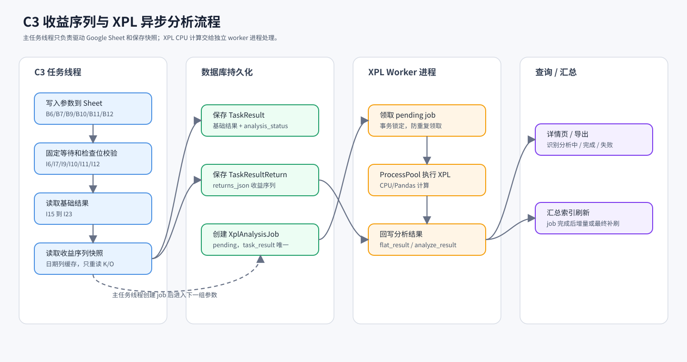
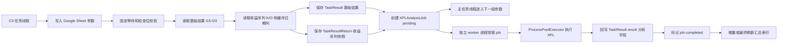
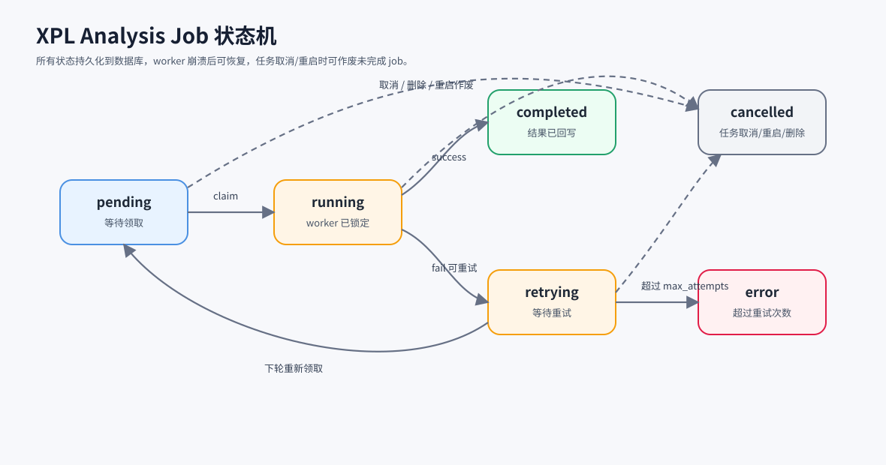
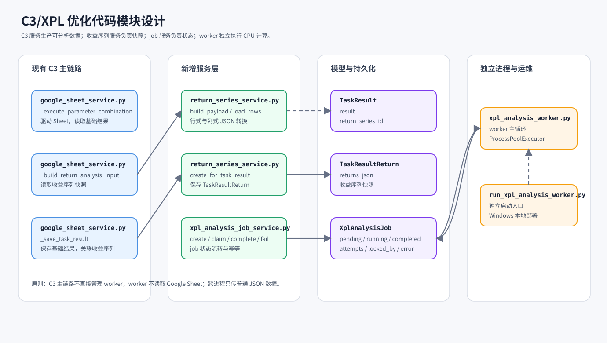

# C系列任务耗时优化方案

## 背景

从一次 C3 任务日志看，单个参数组合的耗时主要由两部分组成：

- Google Sheet 计算等待：约 20 秒。
- 结果后处理：读检查位、读结果位、再次读取收益序列、调用 XPL 分析、保存结果、推送外部接口、写任务日志。

当前 C3 在每个参数组合完成时同步执行收益分析，并把完整 `analyze_result` / `result` 写入任务日志。日志单行可超过 2 万字符，且每条任务日志都会同步写入 `task_logs`，会放大数据库写入成本。

## 最新实测结论（2026-07-06）

使用 `tests/test/d.py` 中 1760 行真实收益序列，对 `xpl_analyzer.get_return_analysis_v1()` 做 12 次重复计算压测：

| 模式 | jobs | workers | wall_s | avg_job_s | 结论 |
|---|---:|---:|---:|---:|---|
| 串行 | 12 | 1 | 14.105 | 1.175 | 基准 |
| 线程池 | 12 | 2 | 15.013 | 2.495 | 无加速，约 0.94x |
| 线程池 | 12 | 4 | 14.821 | 4.854 | 无加速，约 0.97x |
| 线程池 | 12 | 8 | 15.028 | 8.995 | 无加速，约 0.94x |

判断：

- 这份数据下，XPL 更像 CPU/Pandas 计算型工作，而不是 IO 型工作。
- Python 多线程不能作为 XPL 计算吞吐优化方案；线程数增加后单个 job 耗时被明显拉长。
- 后续如果要把 XPL 从主任务线程拆出去，应使用独立 worker 进程或进程池。线程池只适合 worker 内部的数据库读取、状态更新、外部推送等 IO 辅助步骤。

阶段三实现后，新增 `scripts/benchmark_xpl_process_from_d.py` 使用同一份 1760 行真实收益序列做多进程压测。2026-07-06 本机验证结果：

| 模式 | jobs | workers | wall_s | avg_job_s | jobs/s | 结论 |
|---|---:|---:|---:|---:|---:|---|
| 串行 | 6 | 1 | 6.787 | 1.131 | 0.88 | 基准 |
| 进程池 | 6 | 2 | 4.562 | 1.151 | 1.32 | 约 1.49x 加速 |

说明：Windows `ProcessPoolExecutor` 会有进程启动和 payload 序列化成本，实际 worker 应保持常驻，并通过配置控制进程数，避免把 Flask 和任务线程的 CPU 抢满。

生产库采样补充：

通过 `scripts/collect_running_task_logs.py` 连接生产库采集 `running` 任务最新日志，2026-07-06 15:00 采样结果如下：

| 指标 | 样本数 | min | avg | p50 | p95 | max |
|---|---:|---:|---:|---:|---:|---:|
| execute_s | 36 | 21.871 | 25.109 | 24.424 | 28.751 | 35.773 |
| read_s | 30 | 0.376 | 0.571 | 0.451 | 0.870 | 1.589 |
| xpl_s | 30 | 0.270 | 1.395 | 0.983 | 3.000 | 3.244 |
| save_s | 36 | 0.002 | 0.008 | 0.003 | 0.007 | 0.156 |
| push_s | 36 | 0.043 | 0.057 | 0.048 | 0.070 | 0.203 |

按任务周期拆分：

| 分组 | 样本数 | rows | xpl_avg | xpl_p95 | xpl_max |
|---|---:|---:|---:|---:|---:|
| 1y | 16 | 241 | 0.818 | 1.854 | 2.819 |
| 3y | 14 | 725 | 2.055 | 3.083 | 3.244 |

补充判断：

- 生产并发下 XPL 已经出现 CPU 竞争迹象，特别是 `3y` 任务，平均约 2 秒，P95 超过 3 秒。
- `save` 和 `stock_param_push` 耗时很低，不是当前瓶颈。
- `read` 通常在 0.4 到 0.9 秒之间，偶发高位，但不是主要矛盾。
- 固定等待和 Google Sheet 响应仍是单组合主耗时；XPL 适合通过异步化与下一组等待重叠，而不是期望单独优化后把单组合压到 20 秒以内。
- 当前还存在重复成功摘要日志：内层 `参数组合执行成功，结果摘要` 和外层 `第 N 个参数组合执行成功，execute=...` 同时写入。下一步同步链路瘦身应优先删除内层重复摘要，只保留带 `execute` 的外层日志。

## 总体目标

在不破坏任务可恢复性、取消语义、Google Sheet token 占用释放和结果查询兼容性的前提下，逐步把 C 系列任务从“每组参数同步完成全部后处理”优化为“主任务线程专注驱动 Sheet，收益分析和汇总索引异步流水线处理”。

## 本次新增优化策略：收益数据运行期落库，完成后压缩归档

当前每个参数组合都会产生一份收益序列。如果把完整收益序列长期放在数据库 JSON 中，3300 个参数组合会让单个任务产生几十 MB 甚至更大的 JSON 数据，后续查询、备份、迁移和数据库维护都会变重。

因此收益数据存储策略调整为：

1. 任务运行期仍写数据库
   - 每个参数组合完成后，将 `date/index_return/start_return` 转成列式 JSON 写入 `TaskResultReturn.returns_json`。
   - `TaskResult.return_series_id` 指向这份收益序列。
   - 这样任务执行中取消、异常、重启、worker 异步计算时，仍然可以从数据库恢复，不依赖内存队列或 Google Sheet 当前状态。

2. 任务完成后统一压缩归档
   - 当一个任务所有参数组合执行完成后，统一读取该 `task_id` 下所有 `TaskResultReturn`。
   - 将完整收益数据合并写入一个本地 `json.gz` 文件。
   - 推荐路径为 `data/return_series_archives/{task_id}.json.gz`。
   - 归档文件使用相对路径记录，避免部署目录变化导致绝对路径失效。

3. 数据库只保留轻量指针
   - 归档完成后，将每条 `TaskResultReturn.returns_json` 替换为指针 JSON。
   - 指针只保留 `storage=local_gzip`、`path`、`series_id`、`row_count`、`source_columns`、`created_from_step_index` 等元信息。
   - 完整收益序列不再长期占用数据库空间。

4. 读取逻辑统一兼容两种形态
   - 如果 `returns_json` 是运行期列式 JSON，直接解析。
   - 如果 `returns_json.storage == local_gzip`，从 gzip 文件中按 `series_id` 读取完整收益序列。
   - 详情页、导出、XPL worker、收益曲线接口都必须走统一读取服务，不能直接假设数据库里一定保存完整 JSON。

5. 归档失败不影响任务成功
   - 归档属于存储优化，不应改变已经完成的任务状态。
   - 如果 gzip 写入或数据库指针更新失败，只记录 warning 日志，保留数据库原始列式 JSON。
   - 后续通过运维脚本或管理接口重试归档。

这个策略的收益是：任务执行中仍保持可恢复和可异步计算，任务完成后把大体积收益数据移出数据库，数据库只承担索引和元信息存储，降低长期膨胀风险。

## 完整设计思路

### 设计原则

1. 主任务线程只做必须串行的事情
   - 写入 Google Sheet 参数。
   - 等待 Sheet 公式计算完成。
   - 读取检查位和基础结果位。
   - 读取当前组合对应的收益序列快照。
   - 保存足够恢复和重算的数据。

2. 主任务线程不要承担可延后的重计算
   - XPL 分析本质上是基于收益序列的纯计算，不应该长期阻塞下一组参数进入 Sheet。
   - 外部推送、汇总索引刷新、完整分析结果补写都可以拆成后置步骤。

3. 异步 worker 不能回读 Google Sheet 当前状态
   - Google Sheet 会在下一组参数写入后被覆盖。
   - 因此异步 worker 的唯一可信输入必须是主任务线程已保存的收益序列快照。

4. 状态必须持久化
   - 不能只依赖内存队列，否则 Flask 进程重启、worker 崩溃、机器重启后无法恢复。
   - 收益序列、分析 job 状态、失败原因、重试次数都应能从数据库恢复。

5. 并发模型按工作类型区分
   - Google Sheet 访问是 IO 和外部服务等待，继续由现有任务线程控制。
   - XPL 是 CPU/Pandas 计算，使用独立 worker 进程或进程池。
   - 数据库轮询、状态更新、外部推送可以使用普通线程或同步逻辑，但不要把 Python 线程池作为 XPL 计算加速手段。

### 目标架构

图片文件保存在 `docs/design/c-series-task-optimization/`，本文档使用相对路径引用：



文本版 Mermaid 流程如下，便于后续直接编辑：



### 数据流设计

1. 同步阶段生成基础结果
   - `TaskResult.result` 先保存参数、I15 到 I23 基础指标、任务上下文、分析状态。
   - 此时结果可以被查询和导出，但应标记 `analysis_status=pending` 或通过独立 job 表判断分析未完成。

2. 收益序列独立保存
   - 复用现有 `TaskResultReturn.returns_json`。
   - 运行期保存列式 JSON，而不是行式 JSON，减少字段名重复带来的体积膨胀。
   - 运行期列式 JSON 建议包含：
     - `dates`
     - `index_returns`
     - `start_returns`
     - `row_count`
     - `source_columns`
     - `created_from_step_index`
   - `TaskResult.return_series_id` 指向对应收益序列。
   - 任务执行完成后统一归档该任务的收益序列：
     - 将同一 `task_id` 下所有 `TaskResultReturn.returns_json` 合并为一个本地 `json.gz` 文件。
     - 数据库中的 `TaskResultReturn.returns_json` 替换成轻量指针，只保留本地路径、序列 ID、行数、来源列等元信息。
     - 详情页、导出、XPL worker 读取收益序列时，先判断 `returns_json.storage`；如果是本地归档指针，则从 gzip 文件按 `series_id` 读取。
   - 这样运行中任务仍具备数据库恢复能力，任务完成后又能显著降低数据库体积。

3. 分析 job 持久化
   - 新增独立 job 表优先于把调度字段全部塞入 `TaskResult`。
   - 建议字段：
     - `id`
     - `task_id`
     - `task_result_id`
     - `return_series_id`
     - `status`
     - `attempts`
     - `max_attempts`
     - `locked_by`
     - `locked_at`
     - `started_at`
     - `finished_at`
     - `error_message`
     - `created_at`
     - `updated_at`
   - `task_result_id` 加唯一约束，防止同一结果重复创建多个分析 job。

4. worker 回写最终结果
   - worker 读取 `TaskResultReturn.returns_json`。
   - 调用 `xpl_analyzer.get_return_analysis_v1()`。
   - 将 `flat_result` 和 `analyze_result` 合并回 `TaskResult.result`。
   - 标记 job 为 `completed`。
   - 写一条短摘要日志，不写完整 JSON。

### 状态设计



建议 job 状态：

| 状态 | 含义 |
|---|---|
| pending | 已创建，等待 worker 领取 |
| running | worker 已领取并开始处理 |
| completed | XPL 分析完成，结果已回写 |
| retrying | 本次失败但还未超过最大重试次数 |
| error | 超过重试次数或遇到不可恢复错误 |
| cancelled | 原任务取消、删除或重启导致 job 作废 |

`TaskResult` 侧建议保留一个轻量分析状态字段，或者在接口层通过 job 表推导：

| 展示状态 | 数据含义 |
|---|---|
| 基础结果完成 | Sheet 结果已保存 |
| 分析中 | job 为 pending/running/retrying |
| 分析完成 | job completed，`result` 包含 `flat_result/analyze_result` |
| 分析失败 | job error，详情页展示错误摘要 |

### worker 领取与幂等

1. worker 周期性扫描 `pending/retrying` job。
2. 使用数据库事务把 job 从 `pending` 更新为 `running`，同时写入 `locked_by/locked_at`。
3. 多 worker 场景下，领取动作必须保证同一 job 只有一个 worker 成功。
4. worker 崩溃后，超过超时时间的 `running` job 可被恢复为 `retrying`。
5. 回写 `TaskResult.result` 时以 `task_result_id` 为幂等键，重复执行不会生成重复结果。

### 任务生命周期适配

1. 任务正常运行
   - 主任务线程持续创建基础结果、收益序列和分析 job。
   - worker 在后台消费 job。

2. 任务取消
   - 主任务线程停止继续写 Sheet。
   - 对该任务未完成的 job 标记 `cancelled`。
   - 已完成的结果保留，便于用户查看已执行部分。

3. 任务重启
   - 如果断点恢复从某个 step 继续，必须避免旧 step 之后的 job 和结果混入新执行结果。
   - 建议重启时按 step 范围清理或作废对应 `TaskResult`、`TaskResultReturn` 和 analysis job。

4. 任务删除
   - 通过外键级联或显式删除清理 `TaskResult`、`TaskResultReturn`、analysis job。

5. worker 停止或崩溃
   - 主任务仍可继续完成 Sheet 执行。
   - 任务最终状态可以是“Sheet 执行完成，分析仍在后台处理”。
   - worker 恢复后继续处理 pending/retrying job。

### 查询、导出和汇总索引设计

1. 详情页
   - 如果分析完成，展示完整指标。
   - 如果分析未完成，展示 I15 到 I23 基础结果和“分析中”状态。
   - 如果分析失败，展示基础结果和错误摘要。
   - 收益曲线按需读取：
     - 未归档时从 `TaskResultReturn.returns_json` 直接解析。
     - 已归档时从 `returns_json` 指针定位本地 gzip 文件并读取对应 `series_id`。

2. 导出
   - 默认导出当前已有字段。
   - 可增加“仅导出分析完成结果”的选项，避免用户把半成品当最终结果使用。
   - 默认不导出完整收益序列，除非用户明确选择包含收益曲线，避免一次导出触发大量 gzip 解压和内存占用。

3. 汇总索引
   - 阶段三之前仍保持任务结束时刷新。
   - 阶段三之后，不能在还有 pending job 时直接把半成品纳入最终汇总。
   - 推荐策略：
     - job completed 后增量刷新该结果对应的索引。
     - 任务完成时如果仍有 pending job，记录“Sheet 执行完成，分析仍在后台处理”。
     - 全部 job 完成后执行一次最终补刷。

### 并发参数建议

1. 任务线程并发
   - 维持现有任务系统控制，不在本方案中扩大 Google Sheet 并发。
   - 当前生产已有 18 到 19 个 running 任务，XPL 已出现 CPU 竞争，应避免继续在任务线程内增加计算并发。

2. XPL worker 并发
   - 默认 `max_workers = min(可用 CPU 核心数 - 1, 配置上限)`。
   - 生产初始建议从 2 到 4 个进程开始压测。
   - 观察 Flask 响应、任务推进速度、CPU 使用率和 job 堆积量后再调整。

3. 队列领取批次
   - 每轮领取数量不宜过大，避免单个 worker 长时间占有大量 job。
   - 建议每轮领取 `max_workers * 2` 左右。

### 分阶段落地顺序

1. 继续完善阶段一
   - 去掉内层重复成功摘要日志。
   - 保留 `execute/read/xpl/save/push` 分段耗时。
   - 使用 `scripts/collect_running_task_logs.py` 周期性采样，观察 XPL P50/P95。

2. 进入阶段二
   - 先把收益序列结构化落库。
   - 仍然同步调用 XPL，确保结果行为不变。
   - 验证重启、删除、导出、详情页兼容。

3. 进入阶段三
   - 新增 analysis job 表。
   - 主任务线程创建 job 后继续下一组。
   - 独立 worker 进程消费 job 并回写结果。

4. 进入阶段四
   - 适配详情页、导出和汇总索引的最终一致状态。

5. 进入阶段五
   - 如果本地 DB job 表轮询吞吐不足，再考虑 Redis/RQ/Celery。

### 验收指标

1. 性能指标
   - 主任务线程单组合 `execute` 平均耗时下降。
   - XPL 从任务线程耗时中移出，job 队列无长期堆积。
   - Flask 和任务管理接口响应不因 worker 打满 CPU 明显变慢。

2. 正确性指标
   - 同一参数组合的同步版和异步版 `flat_result/analyze_result` 一致。
   - 任务取消、重启、删除后没有遗留可见脏 job。
   - 汇总索引最终结果与同步计算一致。

3. 可运维指标
   - 可以查看 pending/running/error job 数量。
   - 可以重试失败 job。
   - worker 崩溃后重启可恢复。
   - 任务日志保持摘要化，不恢复完整大 JSON。
   - 可以检查收益序列归档文件是否存在、大小是否合理、数据库指针是否可读取。

## 代码设计思路



### 现有代码切入点

当前 C3 主链路集中在 `app/services/google_sheet_service.py`：

| 位置 | 当前职责 | 后续调整方向 |
|---|---|---|
| `_execute_parameter_combination()` | 写参数、等待、读检查位、读结果位、组装最终结果 | 保持 Google Sheet 驱动职责，不直接扩展成大函数 |
| `_build_return_analysis_input()` | 从 Sheet 读取收益序列并构造 XPL 输入 | 拆出“读取收益序列”和“保存收益序列快照”的边界 |
| `_attach_return_analysis()` | 同步读取收益序列并执行 XPL | 阶段二保留同步 XPL；阶段三改为创建分析 job |
| `_save_task_result()` | 保存 `TaskResult` | 扩展为可关联 `return_series_id`，或拆出专门保存方法 |
| `execute_task()` | 任务总流程、循环参数组合、更新进度 | 不直接承载 XPL worker 逻辑 |

已有模型：

| 模型 | 当前可复用点 |
|---|---|
| `TaskResult` | 已有 `return_series_id`，可关联收益序列 |
| `TaskResultReturn` | 已有 `returns_json`，可保存列式收益序列 |
| `TaskLog` | 继续只写摘要日志，不写完整分析 JSON |

### 模块拆分建议

为了避免 `google_sheet_service.py` 继续变大，新增代码建议按职责拆分：

| 文件 | 职责 |
|---|---|
| `app/services/return_series_service.py` | 收益序列 JSON 结构转换、落库、读取、清理 |
| `app/services/xpl_analysis_job_service.py` | 创建 job、领取 job、状态流转、重试、取消 |
| `app/services/xpl_analysis_worker.py` | worker 主循环，调用 job service 和 XPL 计算 |
| `scripts/run_xpl_analysis_worker.py` | 独立 worker 启动入口，便于 Windows 本地启动 |
| `app/models.py` | 增加 `XplAnalysisJob` 模型 |
| `scripts/benchmark_xpl_process_from_d.py` | 用真实数据验证多进程吞吐 |

不建议把 job 领取、XPL 计算、结果回写全部写进 `google_sheet_service.py`。C3 服务应该只负责生产“可分析的数据”和创建 job。

### 阶段一代码调整

阶段一继续保持同步，不改 schema：

1. 去掉重复成功摘要日志
   - 保留外层日志：
     - `第 N 个参数组合执行成功，execute=...，结果摘要: ...`
   - 删除或降级内层日志：
     - `参数组合执行成功，结果摘要: ...`
   - 这样每个成功组合减少一次同步 `TaskLog` 写库。

2. 保留分段耗时
   - `read`
   - `xpl`
   - `save`
   - `stock_param_push`
   - 后续采样脚本继续依赖这些字段做统计。

3. 不在阶段一引入线程池
   - 当前生产采样已经显示 XPL 是 CPU 竞争项。
   - 直接在线程内扩并发会增加抖动。

### 阶段二代码设计：收益序列结构化落库

阶段二目标是“先把异步计算需要的数据保存下来”，但 XPL 仍可同步执行，保证行为变化小。

建议新增 `return_series_service.py`：

```python
class ReturnSeriesService:
    def build_payload(
        self,
        rows: list[dict],
        source_columns: dict,
        step_index: int,
    ) -> dict:
        ...

    def create_for_task_result(
        self,
        task_id: str,
        task_result_id: int | None,
        rows: list[dict],
        source_columns: dict,
        step_index: int,
    ) -> TaskResultReturn:
        ...

    def load_rows(self, return_series_id: int) -> list[dict]:
        ...
```

`returns_json` 建议保存列式结构，减少 JSON 体积并便于检查：

```json
{
  "version": 1,
  "row_count": 725,
  "source_columns": {
    "date": "D",
    "index_return": "K",
    "start_return": "O"
  },
  "created_from_step_index": 12,
  "dates": ["2023-01-01"],
  "index_returns": [0.001],
  "start_returns": [0.002]
}
```

运行期仍先写数据库，原因：

- 任务执行中可能取消、重启、异常退出，数据库内的收益序列更容易和 `TaskResult` 保持事务一致。
- 后续异步 XPL worker 如果要边跑边消费，需要能稳定读取刚生成的收益序列。
- 本地文件归档适合放在任务完成后统一执行，不适合在每个参数组合中频繁打开、写入、压缩文件。

`google_sheet_service.py` 的阶段二改造方式：

1. `_build_return_analysis_input()` 继续返回 XPL 需要的行式结构。
2. `_attach_return_analysis()` 内部记录 `return_data` 后，同步调用 `ReturnSeriesService.create_for_task_result()` 或先临时返回 `return_data`。
3. `_save_task_result()` 保存 `TaskResult` 时写入 `return_series_id`。
4. 如果保存顺序不方便，可拆成两步：
   - 先创建 `TaskResult` 基础记录。
   - 再创建 `TaskResultReturn`。
   - 最后回填 `TaskResult.return_series_id`。

推荐事务边界：

```text
同一个参数组合保存结果时：
1. insert TaskResult
2. insert TaskResultReturn
3. update TaskResult.return_series_id
4. commit
```

如果第 2 或第 3 步失败，应整体回滚，避免出现有结果但找不到收益序列的半状态。

### 阶段二增强：任务完成后归档收益序列

收益序列如果长期保留在数据库 JSON 中，空间压力会比较明显。按真实样本估算：

| 行数 | 行式 JSON | 列式 JSON |
|---:|---:|---:|
| 241 行 | 约 16KB | 约 7KB |
| 725 行 | 约 50KB | 约 22KB |
| 1760 行 | 约 123KB | 约 56KB |

以 `3y` 任务 725 行、3300 个参数组合估算，单任务仅收益序列列式 JSON 就可能达到约 70MB 到 80MB。多个任务长期保留会导致数据库膨胀。因此建议增加“完成后归档”机制：

1. 运行期
   - 每个参数组合仍写 `TaskResultReturn.returns_json` 列式 JSON。
   - `TaskResult.return_series_id` 正常关联。
   - XPL 同步或异步计算都可以直接从数据库读取。

2. 任务完成后
   - 在 `execute_task()` 返回 `completed` 前，或任务状态收尾后，触发 `ReturnSeriesArchiveService.archive_task(task_id)`。
   - 查询该任务全部 `TaskResultReturn`。
   - 将完整收益序列合并写入一个 gzip 文件。
   - 更新每条 `TaskResultReturn.returns_json` 为归档指针。

3. 本地文件路径建议
   - 根目录：`data/return_series_archives/`
   - 文件名：`{task_id}.json.gz`
   - 文档、代码和日志只记录相对路径，避免部署目录变化导致绝对路径失效。

归档文件结构建议：

```json
{
  "version": 1,
  "task_id": "task-id",
  "archived_at": "2026-07-06T15:30:00",
  "series": {
    "123": {
      "version": 1,
      "row_count": 725,
      "source_columns": {
        "date": "D",
        "index_return": "K",
        "start_return": "O"
      },
      "created_from_step_index": 12,
      "dates": [],
      "index_returns": [],
      "start_returns": []
    }
  }
}
```

数据库指针结构建议：

```json
{
  "version": 1,
  "storage": "local_gzip",
  "path": "data/return_series_archives/task-id.json.gz",
  "series_id": 123,
  "row_count": 725,
  "source_columns": {
    "date": "D",
    "index_return": "K",
    "start_return": "O"
  },
  "created_from_step_index": 12
}
```

读取逻辑：

```text
load_return_series(return_series_id)
  -> 读取 TaskResultReturn.returns_json
  -> 如果没有 storage 字段：按运行期列式 JSON 解析
  -> 如果 storage == local_gzip：
       读取 path 指向的 gzip 文件
       从 series[str(series_id)] 取出完整列式 JSON
       转换成 XPL 需要的 rows
```

归档时机：

- 阶段二同步 XPL：任务 `completed` 后即可归档。
- 阶段三异步 XPL：必须等该任务所有 XPL job 都进入 `completed/error/cancelled` 的终态后再归档，或者 worker 的读取逻辑必须支持归档指针。
- 为降低复杂度，建议阶段三 worker 一开始就支持 `local_gzip` 指针读取，这样归档时机更灵活。

归档失败处理：

- 归档失败不应把已经成功完成的任务改成 `error`。
- 只写 warning 日志，并保留数据库内原始列式 JSON。
- 后续可提供一个运维脚本或接口重新执行归档。

注意事项：

- 本地归档文件属于任务结果数据，部署时必须纳入备份策略。
- 删除任务时要同步删除对应 gzip 文件，或提供定期清理孤儿归档文件的脚本。
- 重启任务如果清理某个 step 之后的结果，也要同步处理归档文件；简单做法是重启前如果任务已归档，则先恢复或重建归档文件，避免旧 series 残留。
- 多进程同时归档同一任务时要加锁，避免 gzip 文件互相覆盖。可以用数据库任务状态、归档状态字段，或本地 `.lock` 文件。

### 阶段三代码设计：analysis job 表

建议新增模型 `XplAnalysisJob`：

```python
class XplAnalysisJob(db.Model):
    __tablename__ = "xpl_analysis_jobs"
    __table_args__ = (
        db.UniqueConstraint("task_result_id", name="uk_xpl_analysis_jobs_task_result_id"),
        db.Index("idx_xpl_jobs_status_created", "status", "created_at"),
        db.Index("idx_xpl_jobs_task_status", "task_id", "status"),
        {"comment": "XPL异步分析任务表"},
    )

    id = db.Column(db.Integer, primary_key=True, autoincrement=True)
    task_id = db.Column(db.String(36), db.ForeignKey("tasks.id", ondelete="CASCADE"), nullable=False, index=True)
    task_result_id = db.Column(db.Integer, db.ForeignKey("task_results.id", ondelete="CASCADE"), nullable=False)
    return_series_id = db.Column(db.Integer, db.ForeignKey("task_results_return.id", ondelete="CASCADE"), nullable=False)
    status = db.Column(db.String(20), default="pending", nullable=False, index=True)
    attempts = db.Column(db.Integer, default=0, nullable=False)
    max_attempts = db.Column(db.Integer, default=3, nullable=False)
    locked_by = db.Column(db.String(100))
    locked_at = db.Column(db.DateTime)
    started_at = db.Column(db.DateTime)
    finished_at = db.Column(db.DateTime)
    error_message = db.Column(db.Text)
    created_at = db.Column(db.DateTime, default=datetime.now, nullable=False, index=True)
    updated_at = db.Column(db.DateTime, default=datetime.now, onupdate=datetime.now)
```

状态常量建议集中定义，避免散落字符串：

```python
class XplAnalysisJobStatus:
    PENDING = "pending"
    RUNNING = "running"
    RETRYING = "retrying"
    COMPLETED = "completed"
    ERROR = "error"
    CANCELLED = "cancelled"
```

### job service 设计

`xpl_analysis_job_service.py` 建议提供这些接口：

```python
class XplAnalysisJobService:
    def create_pending_job(
        self,
        task_id: str,
        task_result_id: int,
        return_series_id: int,
    ) -> XplAnalysisJob:
        ...

    def claim_jobs(
        self,
        worker_id: str,
        limit: int,
        stale_after_seconds: int,
    ) -> list[XplAnalysisJob]:
        ...

    def mark_completed(
        self,
        job_id: int,
        flat_result: dict,
        analyze_result: dict,
        elapsed_seconds: float,
    ) -> None:
        ...

    def mark_failed(
        self,
        job_id: int,
        error: Exception,
    ) -> None:
        ...

    def cancel_jobs_for_task(
        self,
        task_id: str,
        from_step_index: int | None = None,
    ) -> int:
        ...
```

领取 job 的 SQL/ORM 必须避免多 worker 重复领取。PostgreSQL 可以优先考虑：

```sql
SELECT id
FROM xpl_analysis_jobs
WHERE status IN ('pending', 'retrying')
ORDER BY created_at
FOR UPDATE SKIP LOCKED
LIMIT :limit
```

如果 SQLAlchemy 封装不方便，也可以在 service 里使用 `text()` 写这一小段原生 SQL。重点是领取动作必须在事务内完成。

### worker 进程设计

worker 不挂在 Flask 请求线程内，使用独立脚本启动：

```text
scripts/run_xpl_analysis_worker.py
```

启动流程：

1. 设置 UTF-8 输出。
2. `create_app()` 初始化 Flask app 和数据库。
3. 进入 `app.app_context()`。
4. 创建 `worker_id`，例如 `hostname-pid`。
5. 循环领取 job。
6. 使用 `ProcessPoolExecutor` 执行 XPL。
7. 回写结果和 job 状态。
8. 空闲时 sleep，避免频繁扫库。

进程池函数必须是顶层函数，方便 Windows `spawn` 模式序列化：

```python
def run_xpl_analysis(return_rows: list[dict]) -> tuple[dict, dict]:
    from app.services.xpl_service import XPLAnalyzer

    analyzer = XPLAnalyzer()
    return analyzer.get_return_analysis_v1(return_rows)
```

不要把已经创建好的 `xpl_analyzer`、数据库 session、Flask app 对象传入子进程；这些对象不可安全跨进程复用。

### 主任务线程接入方式

阶段三后，C3 保存结果逻辑建议变成：

```text
_execute_parameter_combination()
  -> 读取 Sheet 基础结果
  -> 读取收益序列 return_data
  -> 返回 final_results + return_data

execute_task() 循环内
  -> 保存 TaskResult 基础结果
  -> 保存 TaskResultReturn
  -> 创建 XplAnalysisJob pending
  -> 写短日志
  -> 进入下一组参数
```

`final_results` 中可以先写：

```json
{
  "analysis_status": "pending",
  "flat_result": null,
  "analyze_result": null
}
```

worker 完成后再合并：

```json
{
  "analysis_status": "completed",
  "flat_result": {},
  "analyze_result": {}
}
```

这样详情页和导出逻辑可以明确识别分析状态，不会把半成品误判为完整结果。

### 配置设计

新增配置不应直接散落读取环境变量，优先走现有 `config_manager` 或 app config：

| 配置项 | 默认值 | 含义 |
|---|---:|---|
| `xpl_analysis_async_enabled` | false | 是否启用异步 XPL |
| `xpl_analysis_worker_processes` | 2 | worker 进程池并发数 |
| `xpl_analysis_claim_batch_size` | 4 | 每轮领取 job 数量 |
| `xpl_analysis_poll_interval_seconds` | 2 | 无 job 时轮询间隔 |
| `xpl_analysis_job_timeout_seconds` | 300 | running job stale 判定 |
| `xpl_analysis_max_attempts` | 3 | 最大重试次数 |

阶段二可以先加入开关但默认关闭异步：

```text
xpl_analysis_async_enabled=false
```

这样可以保留同步路径作为回滚手段。

### 路由和运维接口设计

如果进入阶段三，建议补充内部运维接口，方便观察 worker：

| 接口 | 用途 |
|---|---|
| `GET /admin/api/xpl-analysis/jobs/stats` | 查看 pending/running/error/completed 数量 |
| `GET /admin/api/xpl-analysis/jobs` | 分页查看 job |
| `POST /admin/api/xpl-analysis/jobs/<id>/retry` | 重试单个失败 job |
| `POST /admin/api/tasks/<task_id>/xpl-analysis/retry-failed` | 重试某任务失败 job |

这些接口应放在 admin 或内部运维路由下，并使用现有权限体系，不要做公开接口。

### 重启、取消、删除接入点

异步 job 会改变任务生命周期，需要在现有 task manager 相关模块补钩子：

| 文件 | 需要处理 |
|---|---|
| `app/services/task/restart.py` | 重启时作废或清理重启范围内未完成 job |
| `app/services/task/restart.py` | 取消任务时标记 pending/running job 为 `cancelled` |
| `app/services/task/query.py` / `results.py` | 查询结果时带出分析状态 |
| `app/services/model_summary_service.py` | 汇总索引跳过分析未完成结果，或等 job 完成后补刷 |

如果当前删除任务依赖 SQLAlchemy cascade，`XplAnalysisJob.task_id` 和 `task_result_id` 外键都应设置 `ondelete="CASCADE"`，避免孤儿 job。

### 测试设计

阶段二测试：

1. `ReturnSeriesService.build_payload()` 能把行式收益序列转成列式 JSON。
2. `ReturnSeriesService.load_rows()` 能恢复为 XPL 需要的行式结构。
3. `_save_task_result()` 保存后 `TaskResult.return_series_id` 不为空。
4. 旧结果没有 `return_series_id` 时，详情和导出仍兼容。

阶段三测试：

1. `create_pending_job()` 对同一个 `task_result_id` 幂等。
2. `claim_jobs()` 不重复领取同一个 job。
3. `mark_completed()` 正确合并 `flat_result/analyze_result`。
4. `mark_failed()` 在未达最大次数时进入 `retrying`，超过后进入 `error`。
5. `cancel_jobs_for_task()` 能取消指定任务未完成 job。
6. worker 子进程函数只接收普通 JSON 数据，不依赖 Flask app 或 db session。

回归测试：

1. 同一份收益序列，同步 XPL 与 worker XPL 结果一致。
2. 任务取消、重启、删除后没有遗留 pending/running job。
3. 汇总索引最终结果与同步版本一致。

### 回滚设计

必须保留同步路径作为开关回滚：

```text
if xpl_analysis_async_enabled:
    保存收益序列并创建 job
else:
    同步执行 _attach_return_analysis()
```

上线顺序建议：

1. 先上线收益序列落库，但仍同步 XPL。
2. 验证数据一致性和查询兼容。
3. 开启 worker，但只处理少量任务或测试任务。
4. 再打开生产异步开关。
5. 如出现异常，关闭 `xpl_analysis_async_enabled` 回到同步路径。

## 阶段一：低风险同步链路瘦身

目标：不改变数据库结构，不改变任务完成语义，不引入新进程或队列，先减少明显的同步开销并补齐观测能力。

修改点：

1. 增加分段耗时日志
   - 记录读收益序列、XPL 计算、结果保存、外部推送等关键阶段耗时。
   - 日志只记录摘要，不记录完整大 JSON。

2. 压缩任务日志内容
   - `收益率分析执行完成` 只输出关键指标摘要和耗时。
   - `参数组合执行成功` 只输出参数、核心结果字段、是否包含收益分析、耗时。
   - 外层成功日志不再重复打印完整结果。

3. 缓存收益分析日期列
   - C3 同一任务内日期列通常稳定，缓存 `date_column` 对应日期值。
   - 每个参数组合只重新读取 `index_return` / `start_return` 两列。

4. 保持现有行为
   - `TaskResult.result` 仍保存完整 `analyze_result` / `flat_result`。
   - 任务成功、失败、取消、重启行为不变。
   - 汇总索引仍在任务结束时刷新。

验收：

- C3 任务能继续成功写入完整结果。
- 任务日志明显变短。
- 日志中能看到后处理各段耗时。
- 现有定向测试通过。

## 阶段二：C3 收益序列结构化落库

目标：为异步分析做数据基础，让主线程不依赖 Google Sheet 的历史状态。当前模型中已经存在 `TaskResult.return_series_id` 和 `TaskResultReturn.returns_json`，因此阶段二优先复用既有表结构，不重复创建收益序列表。

修改点：

1. C3 复用 `TaskResultReturn`
   - 将 `dates/index_returns/start_returns` 存入 `TaskResultReturn.returns_json`。
   - `TaskResult.return_series_id` 关联收益序列。

2. 拆分结果状态
   - `TaskResult.result` 先保存 Sheet 基础结果。
   - 不建议只在内存中记录分析状态，应增加持久化分析 job 表或结果分析状态字段，表示 `pending/running/completed/error`。
   - 如果后续进入阶段三，优先新增独立 job 表；这样不会把 `TaskResult` 变成过重的调度表，也便于失败重试和 stale job 恢复。

3. 查询兼容
   - 详情页和导出逻辑优先读 `TaskResult.result` 中已有分析。
   - 分析未完成时显示基础指标和分析中状态。

验收：

- C3 结果详情能读取收益曲线。
- 重启和删除任务能清理 `TaskResultReturn`。
- 未完成分析不会被误认为最终完整结果。

## 阶段三：本地异步分析 worker

目标：主任务线程只负责驱动 Google Sheet 和保存快照，XPL 分析后台处理。

修改点：

1. 新增分析任务表或复用状态字段
   - 字段包括 `task_id`、`task_result_id`、`return_series_id`、`status`、`attempts`、`error_message`、`started_at`、`finished_at`。
   - 对 `task_result_id` 做唯一约束，保证幂等。

2. 新增本地 worker
   - Windows 本地优先使用独立 worker 进程，避免和 Flask 请求线程、任务线程互相阻塞。
   - XPL 计算使用 `ProcessPoolExecutor` 或固定数量子进程，不使用 Python 线程池作为计算并发主力。
   - 线程池只用于 DB 轮询、轻量状态更新、外部推送等 IO 型工作。
   - worker 从数据库领取 pending job，读取 `TaskResultReturn.returns_json`，调用 `xpl_analyzer.get_return_analysis_v1()`，回写 `TaskResult.result`。
   - worker 并发数默认不应超过 `CPU核心数 - 1`，并预留配置项限制进程数，避免把本机 CPU 打满导致 Flask 和任务线程响应变慢。

3. 失败与恢复
   - job 支持最大重试次数。
   - worker 启动时恢复 stale running job。
   - 任务取消或重启时清理对应 pending/running job。

4. 触发条件
   - 单个 C3 结果的 XPL 段稳定超过 3 秒，或批量任务中 XPL 累计耗时明显影响主任务进入下一组参数。
   - 固定等待和 Google Sheet 计算仍然是主耗时时，不应把阶段三作为首要优化项。

验收：

- 主任务线程进入下一组参数的速度提升。
- worker 崩溃后重启可继续处理。
- 同一结果不会重复生成多个分析结果。
- 多进程压测相对串行有稳定吞吐提升；线程池压测结果不作为 XPL 计算优化验收依据。

## 阶段四：汇总索引异步适配

目标：避免分析异步后汇总索引读取半成品。

修改点：

1. job 完成后增量刷新对应任务或结果的汇总索引。
2. 任务完成时如果仍有 pending 分析，记录“任务 Sheet 执行完成，分析仍在后台处理”。
3. 所有分析完成后执行最终补刷并写任务日志。

验收：

- 汇总页不会展示缺失分析字段的候选结果。
- 最终补刷后汇总结果与同步计算一致。

## 阶段五：队列化与部署演进

目标：从本地进程演进到稳定队列基础设施。

可选路径：

1. SQLite / PostgreSQL job 表轮询
   - 改动最小，适合本地 Windows。
   - 吞吐一般，但足够支撑初期分析 worker。

2. Redis + RQ / Celery
   - 适合生产环境和多机扩展。
   - 需要引入 Redis、worker 进程管理、任务监控和部署脚本。

建议：

- 本地先用数据库 job 表验证收益。
- 确认瓶颈转移到 worker 后，再决定是否引入 Redis 队列。

## 风险清单

- 异步 worker 不能再读 Google Sheet 当前公式结果，否则下一组参数会覆盖上一组收益序列。
- `TaskResult.result` 从同步完整结果变成最终一致后，详情页、导出、汇总索引都要能识别分析状态。
- 多线程只适合 IO 和轻量 CPU；本次 1760 行真实数据压测显示 XPL 线程池无加速，XPL 如成为 CPU 瓶颈，应使用多进程或独立 worker 进程池。
- 任务取消、重启、删除必须同步清理分析 job 和收益序列。
- 大日志会显著影响数据库写入，任何阶段都不应恢复完整 JSON 日志。
- 收益序列完成后归档到本地 gzip 后，数据库不再持有完整收益数据，必须把 `data/return_series_archives/` 纳入备份、迁移和部署目录规划。
- 已归档任务的详情页、导出、异步 worker 都必须支持从数据库指针读取本地 gzip；不能假设 `TaskResultReturn.returns_json` 永远是完整列式 JSON。
- 删除任务、重启任务、清理历史结果时，需要同步删除或重建本地归档文件，避免数据库指针指向不存在的文件，或归档文件残留旧 series。
- 归档动作不能影响任务成功状态；归档失败时保留数据库列式 JSON，记录 warning，并支持后续手动重试归档。
